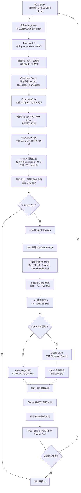

# ClawDPO (Prototype)

ClawDPO 是一个由 Codex 编排的 DPO 迭代系统：它从脱敏业务对话中发现问题，让当前模型重新生成候选回复，构造高价值偏好对，启动训练，并用测试集机评决定是否保留新模型。

项目边界止于候选模型和评测报告，不负责发布或部署。v1 只训练单轮回复，不做多步 agent trajectory。

## 核心产出

ClawDPO 最重要的产出不是单个最终模型，而是一串版本化的训练三元组：

`(Base Model, High-quality Dataset Revision, Trained Model Path)`

每轮都让 Base Model 重新生成适合自己的高质量偏好数据，再训练出 Candidate
Model。无论 Candidate 是否晋级，这个三元组都会保留；晋级模型继续驱动下一轮
数据生产，多个三元组共同构成 Data Flywheel。

同一个 Base Model 可以连续产生多个训练三元组。只有 Candidate 在 Test Set 上
明确超过 Base，当前 Base Stage 才成功结束；失败 Candidate 经过诊断后留档，
下一次训练仍从原 Base 开始。

即使最后一版模型效果不好，前面保存的高质量 Dataset Revision 仍然有效。可以
回到一个可靠的 Base Model，重新选择和组合这些数据训练新模型，不必从零开始。

## 流程



## 文档

- [项目动机](docs/motivation.md)：为什么要做、希望解决什么问题。
- [数据价值证据](docs/data-value.md)：为什么 rollout 和 Preference Pair 值得训练，以及如何保留可复核证据。
- [设计规范](docs/design.md)：v1 的完整架构、数据筛选规则和运行流程；这是实现行为的唯一权威文档。
- [领域术语](CONTEXT.md)：项目内统一使用的概念和名称。
- [架构决策](docs/adr/)：重要取舍及其原因。
- [文档索引](docs/README.md)：文档职责和维护规则。
- [迭代编排 prompt](prompt/迭代编排.md)：启动长期 Codex session 时发送的外层循环指令。
- [Codex 训练对构造](prompt/codex/训练对构造.md)：每个 subagent 只接收一个
  经过机评和 likelihood 边际裁剪的 prompt 组，同时完成事实性复核、质量比较和
  黄金 pair 构造；并发方式由外层迭代编排统一控制。
- [Codex 错误分叉定位](prompt/codex/错误分叉定位.md)：Branch Localization
  Critic 使用 Codex 的上下文和工具定位最早的语义分叉。
- [Codex 分叉结果评测](prompt/codex/分叉结果评测.md)：Branch Outcome Critic
  匿名检查两组回复的事实性、任务完成情况和质量胜负。
- [Codex 训练失败诊断](prompt/codex/训练失败诊断.md)：Candidate 未晋级时，
  先检查数据，再根据重评分和训练日志判断训练动态，并规定同一 Base 的下一次
  单一改动。

当前状态：单轮工具链和高概率错误回复的 token 分叉验证链已完成；多轮执行由
Codex session 按迭代编排 prompt 持续调用这些入口。

## 启动 Codex session

在仓库根目录启动 Codex，把 [迭代编排 prompt](prompt/迭代编排.md) 作为首条
指令，并附上最大轮次、Best Model、Prompt Pool、Test Set、两份机评 request
template 和 runs 目录即可。

Codex 负责监控、调用命令、两次充当分叉 critic 并筛选 pair；历史汇总、Prompt
Pool 转换、Test 机评汇总与运行报告由固定脚本完成。临时查看和切片数据时仍可
使用 shell 或 `jq`。进度持续写入 `<runs_dir>/report.md`。

## 开发入口

```bash
python infra/inference/rollout.py --help
python infra/inference/rescore.py --help
python infra/inference/branch_rollout.py --help
python workflow/locate_branch_points.py --help
python workflow/evaluate_branch_points.py --help
python workflow/prepare_data.py --help
python workflow/evaluate_test.py --help
python workflow/build_diagnosis_packet.py --help
python workflow/run_iteration.py --help
python workflow/run_report.py --help
uv run python -m unittest discover -s tests
```
